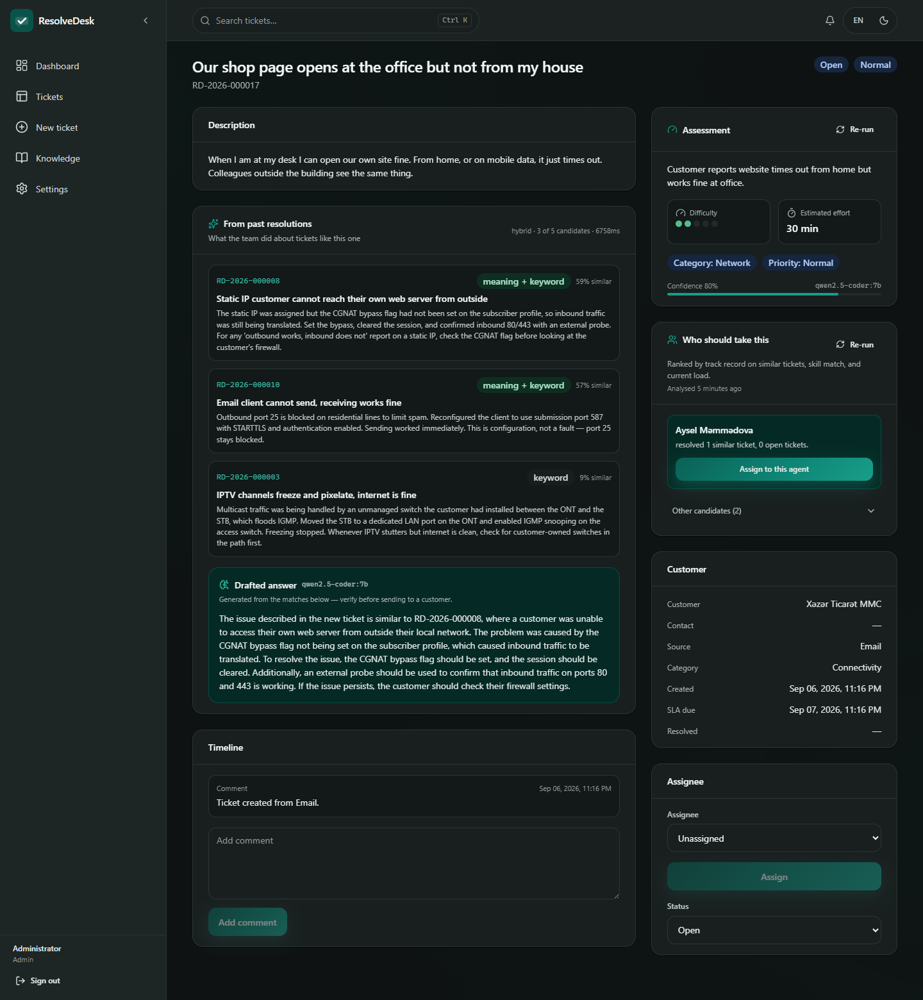
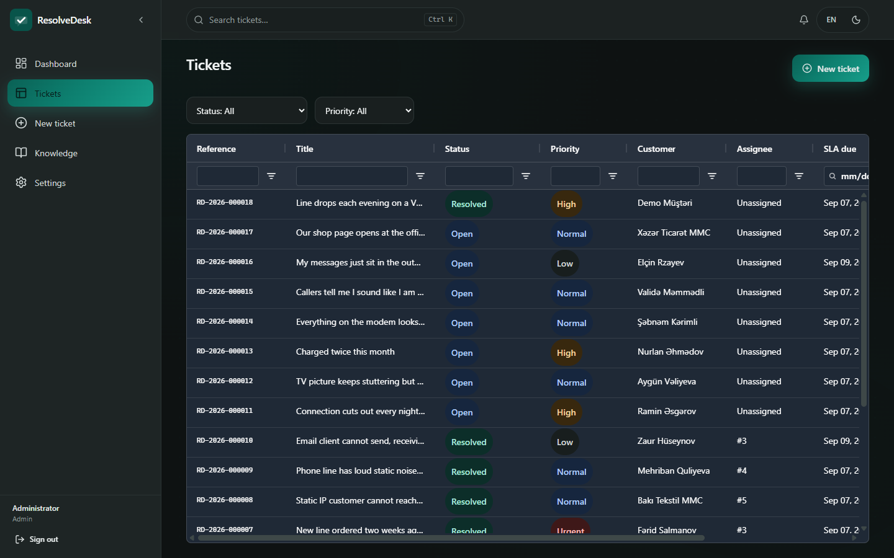
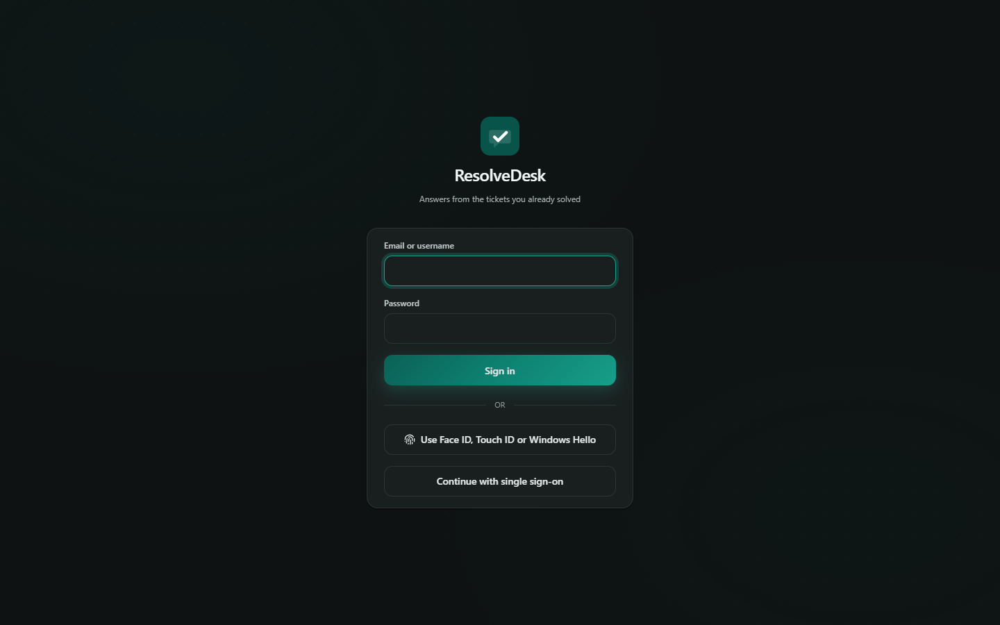
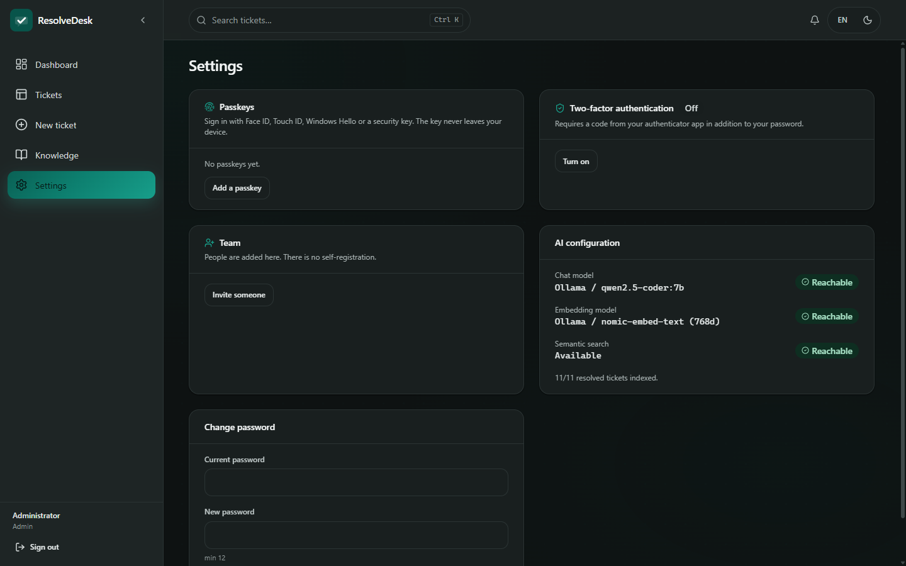
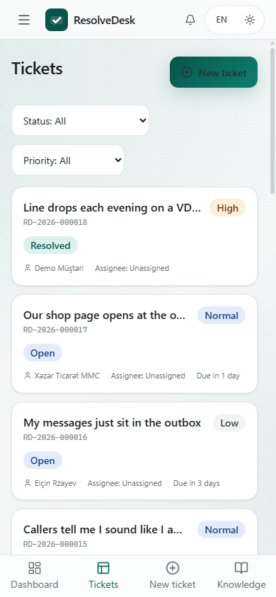

# ResolveDesk

> Call-center ticket management for a technical team, whose defining feature is that **every new
> ticket is answered from the team's own history**: the incoming problem is matched against past
> resolutions with hybrid retrieval (pgvector + full-text), and a model drafts an answer grounded in
> what actually worked before.
>
> **Native AOT API · PostgreSQL + pgvector · configurable AI (local or hosted) · internal MCP server.**



*A customer writes "our shop page opens at the office but not from my house". The archive returns the
CGNAT ticket first — 59%, matched on **meaning and keyword** — and the drafted answer cites it by
reference. Nobody typed the words "CGNAT" into the search box, because nobody knew to.*

---

## Screens

| | |
|---|---|
|  |  |
| **The queue.** AG Grid above 1024px — column filters, sortable, keyset-paginated. | **Signing in.** Methods are a set, not a choice: the screen shows whatever the deployment turned on. |
|  |  |
| **Credentials people manage themselves**, and the team card where accounts are created — there is no sign-up form. | **Below 1024px the grid becomes tile cards**, because a data grid on a phone is a data grid nobody reads. Light theme. |

## Documentation

| | |
|---|---|
| **[Decision log](docs/decisions.md)** | Twenty decisions with the reasoning — and, where a number was involved, the measurement that settled it. Several record being wrong first. **Start here if you want to know how this was built rather than what it does.** |
| [User guide](docs/user-guide.md) | For agents and coordinators working the queue |
| [Administrator guide](docs/administrator-guide.md) | Configuration, accounts, multi-instance, monitoring |
| [Developer guide](docs/developer-guide.md) | Architecture, schema, the AOT rules, the traps |

## Why it exists

Support teams solve the same problem repeatedly and lose the answer each time. ResolveDesk keeps a
coordinator's queue like any modern task tool — routing, SLA, statuses, timeline — and adds one thing:
when a ticket is resolved, that resolution becomes searchable knowledge, and the next similar ticket
surfaces it before anyone starts investigating.

Nothing about that requires a cloud account. Point it at a local Ollama and the whole loop —
embeddings, retrieval, drafted answers — runs on your machine.

## What's in the box

| Piece | Stack |
|---|---|
| **API** | .NET 10 Minimal API, **Native AOT**, `CreateSlimBuilder`, source-generated JSON |
| **Data** | PostgreSQL + **Dapper.AOT**, keyset pagination, **pgvector** HNSW index |
| **Retrieval** | Hybrid: cosine similarity ⊕ `ts_rank_cd`, fused with reciprocal rank fusion |
| **AI** | Ollama · OpenAI · Azure OpenAI · Gemini · anything OpenAI-compatible — chosen per capability from config |
| **MCP** | `resolvedesk-mcp` — 10 tools over stdio, incl. a **Semantic Kernel** triage agent |
| **Auth** | Local (PBKDF2) · **LDAP / Active Directory** · OIDC — one config value apart |
| **Triage** | Difficulty 1–5, effort estimate, category/priority, duplicate detection — per ticket |
| **Routing** | Deterministic, explainable: track record ⊕ skills ⊕ current load |
| **Review** | On resolve: customer-ready rewrite + comparison against past practice |
| **Live** | SSE notifications, browser notifications, PWA app badge, SLA-risk watcher |
| **Web** | React 19 + Vite + Tailwind, AG Grid ≥1024px / tile cards <1024px, PWA, dark mode, az/en |

## Architecture

```
                    ┌─────────────────────────────────────────────┐
  Browser  ───────► │  ResolveDesk.WebApi        (Native AOT)      │
  (React SPA)       │  minimal API · JWT · rate limit · OpenAPI    │
                    └───────────────┬─────────────────────────────┘
                                    │
                    ┌───────────────▼─────────────────────────────┐
                    │  ResolveDesk.Application  (ports, no deps)  │
                    │  ITicketRepository · ISemanticIndex ·       │
                    │  ISuggestionService · IIdentityValidator    │
                    └───────────────┬─────────────────────────────┘
                                    │
                    ┌───────────────▼─────────────────────────────┐
                    │  ResolveDesk.Infrastructure                 │
                    │  Dapper.AOT ─► PostgreSQL + pgvector        │
                    │  AiChatClient / AiEmbeddingClient ─► model  │
                    │  Local | LDAP identity · backfill worker    │
                    └─────────────────────────────────────────────┘

  Claude / Cursor ─► resolvedesk-mcp (stdio) ─► the API above
                     └─ Semantic Kernel triage agent (function calling)
```

Dependencies point inward only. `Core` is pure records; `Application` declares the ports;
`Infrastructure` is the only project that knows about PostgreSQL, HTTP or a directory server.

## The retrieval pipeline

```
new ticket ──► embed (768-d)  ──► pgvector: ORDER BY embedding <=> query   ──┐
           └─► lexemes OR-joined ──► ts_rank_cd(search_tsv, q, 36), GIN index ─┤
                                                                            ▼
                                          reciprocal rank fusion (k = 60)
                                                                            │
                                          top N resolutions ────────────────┤
                                                                            ▼
                                          chat model drafts an answer
                                          grounded strictly in those
```

Every stage is optional, and the response says which ones ran (`strategy: hybrid | semantic |
keyword | none`):

- **no embedding model** → lexical only,
- **no pgvector** → lexical only, on a plain PostgreSQL,
- **no chat model** → matches returned without a draft,
- **nothing configured** → the product still works, just without AI.

Embeddings are produced by a background worker keyed on a content hash, so closing a ticket never
waits on a model, an edited resolution is re-embedded, and an index built after the fact catches up
on its own.

## AI across the whole lifecycle

Retrieval is the headline, but the model is used at four more points — and at each one it advises,
never decides. Nothing it produces is written onto the ticket.

**On intake** — a background assessment sizes the ticket: difficulty 1–5, hands-on minutes, a
category and priority, and whether it repeats a ticket already open. Duplicate detection looks at the
same customer calling again *and* at textually close open tickets from anyone, which is what catches
one outage arriving as twenty calls. Confidence is shown, not hidden; a low number is the signal to
ignore the rest.

**On coordination** — a routing recommendation, and this one is **arithmetic, not a model**:

```
score = 0.5 · resolved-similar-before  +  0.3 · skill-match  +  0.2 · availability
```

The three inputs are on screen for every candidate. A coordinator overrules a recommendation far more
readily when they can see that someone came top on an empty queue rather than on experience — and
when there is no track record and no skill match at all, the reason says exactly that instead of
dressing up "least busy" as a match. The model's contribution arrives upstream, as the difficulty and
category that describe the work.

**On resolution** — the agent's notes are tidied into two things: a reply that can be sent to the
customer, and a clean internal summary for the archive. The original text is never modified. At the
same time the resolution is compared with how the team solved the same thing before:

| Verdict | Meaning |
|---|---|
| `Consistent` | Same approach as past resolutions |
| `Differs` | Same result, different route — worth a look |
| `Novel` | Nothing comparable; this is new knowledge |
| `Conflicts` | Contradicts a past resolution — **coordinators are notified** |

**Continuously** — a watcher warns about tickets approaching their SLA, once each, to the assignee
(or to the coordinators when nobody owns it, because that is a routing failure, not an agent's
problem). Idempotence comes from a `NOT EXISTS` against the notifications table rather than a flag
column on the ticket.

Every model call a user would otherwise wait for runs on a background queue: creating a ticket and
resolving one both return immediately, and a model outage degrades the feature instead of failing the
write that triggered it.

## Tuning the retrieval, with numbers

`tools/validate-retrieval.mjs` embeds the demo archive and the reworded open tickets with the
configured model and checks that each one's true counterpart ranks first — **no database required**,
just Ollama. It exists because `MinSimilarity` started life as a number copied from a paper, and a
copied number is a guess until something measures it.

Running it changed two things:

**The threshold was wrong.** At the original 0.35, *35 of 36* unrelated pairs cleared it — the filter
was doing nothing. `nomic-embed-text` compresses its scores into roughly 0.33–0.74, so an absolute
threshold tuned for a different model is meaningless. The sweep:

| threshold | true kept | distractors through | headroom above weakest true match |
|---|---|---|---|
| 0.40 | 7/7 | 57/63 | 0.182 |
| 0.45 | 7/7 | 42/63 | 0.132 |
| **0.50** | **7/7** | **18/63** | **0.082** ← default |
| 0.55 | 7/7 | 12/63 | 0.032 |

The populations *overlap* — the weakest true match (0.582) scores below the strongest distractor
(0.630) — so no threshold can separate them. Ranking does the discrimination; the threshold is only a
floor. 0.55 buys six fewer distractors for half the safety margin, which is a bad trade on a
seven-query sample. Hence 0.50, and hence it lives in configuration: the scale belongs to the model,
not to this product.

**The demo data was flattering itself.** The first four open tickets ranked first on keyword overlap
alone, so the demo proved nothing about retrieval quality. Three more were added, worded the way a
customer actually speaks — *"callers tell me I sound like I am underwater"* against an engineer's
write-up of *"low insulation resistance on the B leg — water in the joint box"*.

**And then the harness itself turned out to be wrong about keyword search.** Its lexical column is a
crude term-overlap stand-in, and it missed rank 1 on 3 of those 7. Measured against the real
PostgreSQL implementation, `ts_rank_cd` with the right normalisation gets **7 of 7** — including the
"underwater" one, first by a 5× margin. The approximation was underselling the baseline, so the
harness now labels that column as indicative only. Which normalisation is not obvious either:

| `ts_rank_cd` normalisation | ranked #1 |
|---|---|
| 0, 1, 2, 8, 16, 32, 33 | 5–6 of 7 |
| **4** and **36** (= 4 \| 32) | **7 of 7** |

Flag 4 divides by the mean harmonic distance between term occurrences — it rewards documents where
the query's terms appear *near each other*, which is exactly what "same problem, different words"
looks like. Flag 32 then maps the score into [0,1) monotonically, so the ordering survives. The
original code used neither, and multiplied by 10 and clamped at 1.0, which saturated every score to
100% and left `ORDER BY` falling through to the resolution date. Every result was in the wrong order,
and confidently labelled 100%.

```bash
node tools/validate-retrieval.mjs            # 7/7, with the full distribution
MIN_SIMILARITY=0.45 node tools/validate-retrieval.mjs   # sweep a candidate
```

## What hybrid retrieval actually bought

Measured on the demo archive, same seven paraphrased tickets, same machine — the only difference is
whether pgvector was installed:

| | ranked #1 |
|---|---|
| keyword only (`ts_rank_cd`, normalisation 36) | **6 / 7** |
| hybrid (pgvector ⊕ keyword, fused with RRF) | **7 / 7** |

Keyword search is a stronger baseline than it gets credit for — six of seven, on customer wording that
shares little vocabulary with the engineer's write-up. The case it loses is instructive: for *"our shop
page opens at the office but not from my house"*, two archive tickets tie at `rel 0.091`, and the
tie-break falls through to the resolution date, which picks the wrong one. Nothing about the lexical
signal can separate them. The vector half scores them 59% and 57% — a small margin, but a real one,
and it puts the CGNAT ticket first.

That is the honest case for the embedding model: not that keyword search fails, but that it goes flat
exactly where two tickets use the same words for different problems.

## Tests

```bash
dotnet test                                  # unit tests; database tests report as skipped
RESOLVEDESK_TEST_DB="Host=localhost;Port=5432;Database=postgres;Username=postgres;Password=postgres"   dotnet test                                # 70 tests, database included
```

The variable points at a **server**, not at a database to use: the fixture creates and drops
`resolvedesk_test` around the run, and builds its schema through the application's own `DbSchema`, so
the tests exercise the DDL that ships rather than a copy that can drift. Without the variable the
database tests are reported as **skipped**, never as passed — a green run on a machine with no
PostgreSQL should not be mistakable for coverage. CI sets it against a `pgvector/pgvector` service
container and then fails the build if the skipped count is not zero.

**What the tests are for.** Six bugs in this repository were found by running it, not by compiling it;
the build was 0 warnings, 0 errors while retrieval returned nothing, then returned everything at 100%,
and every timestamp read threw. So the suite is weighted towards the seams a type system cannot see —
the SQL, the Npgsql type mapping, the configuration parsing, the model's output — and each regression
test names the bug it stands for.

**They were checked against the bugs.** Each regression test was run with its fix reverted, and only
kept once it failed. Two did not, at first: the ranking test seeded decoys that matched nothing, so a
single result made the assertion vacuous, and a saturation test seeded near-identical tickets, where
equal scores are the *correct* answer. Both were rewritten until reintroducing the bug turned them
red. A regression test that has never seen its bug fail is a guess.

## Signing in

Sign-in methods are a **set, not a choice**. A deployment turns on as many as it wants and the screen
offers all of them at once — corporate SSO for staff, a password for the contractor, a passkey for
whoever has enrolled one:

```jsonc
"Auth": {
  "Enabled": true,
  "Methods": [ "Password", "Oidc", "Passkey" ],
  "Provider": "Ldap",                    // where a password is checked: Local | Ldap
  "Totp":     { "Enabled": true, "Required": false },
  "Passkey":  { "RelyingPartyId": "desk.example.org", "Origins": [ "https://desk.example.org" ] },
  "Invitations": { "LifetimeHours": 48, "BaseUrl": "https://desk.example.org" }
}
```

| Method | What it is |
|---|---|
| **Password** | Checked against the local users table (PBKDF2) or an LDAP/AD bind |
| **Passkey** | WebAuthn — Face ID, Touch ID, Windows Hello, or a security key |
| **OIDC** | Single sign-on — either shape, see below |
| **TOTP** | Optional second factor after a password, per account |

**There is no sign-up form.** An account exists because someone who already has one created it, and
the new person receives a **single-use setup link** rather than a password a colleague picked and
emailed. Only the token's SHA-256 hash is stored, so the URL is shown exactly once — the product
cannot show it again because it no longer knows it — and opening it burns it. A forwarded invitation
is a dead link, not a permanent way in.

The second factor enrols in two steps on purpose: the secret is stored when generated, but the factor
stays **off** until a code proves the authenticator actually holds it. Enabling it on trust would let
one mistyped scan lock someone out of their own account. Turning it off needs a current code too, so a
borrowed session cannot quietly strip it.

Passkey attestation is deliberately **not** verified. Attestation answers "what make of authenticator
is this", which matters when only certified hardware may be used; for a support desk it buys nothing
and costs a metadata service and a certificate chain. Everything that carries the actual guarantee —
the challenge, the origin, the relying party, the signature over both, and a signature counter that
must advance — is checked.

### Single sign-on, in two shapes

Set `Oidc:ClientId` and **this API runs the flow**: authorization code with PKCE, the exchange over a
back channel, the provider's ID token validated against its JWKS, and then a **ResolveDesk** token
issued. That last step is what lets SSO sit beside a password and a passkey — whichever method someone
used, the session that comes out is identical, so roles, expiry and authorization work one way.

Leave `ClientId` empty and it stays as it was: the SPA obtains a token from the provider and this API
validates that instead. Fewer moving parts where an identity layer already sits in front. The two
disagree about whose token is trusted, so they are mutually exclusive, and the first log line at
startup says which one is running.

The session crosses the final redirect as a **60-second single-use code**, not as the token. A token
in a query string lands in proxy logs; in a fragment it lands in browser history. A code that expires
in a minute and works once is worth far less in either place than an eight-hour session.

### Running more than one instance

Every sign-in here spans two requests — a password then a code, a challenge then an assertion, a
redirect out then a redirect back — and behind a load balancer the second one need not reach the
instance that served the first. So none of that state lives in process memory: the handles go in a
`auth_handles` table, redeemed with `DELETE … RETURNING` so that two instances racing on one handle
produce exactly one winner, and stored as a SHA-256 hash so a database dump yields nothing usable.

One thing is **not** shared: the sign-in rate limiter is still per-process, so N instances allow N×
the attempts. Moving it to the database would mean a write per request; the usual answer is to limit
at the load balancer, or to add Redis. It is called out rather than left to be discovered.

```bash
node tools/auth-smoke.mjs      # 42 checks: invitations, TOTP, passkey challenges, rate limiting

node tools/fake-oidc-provider.mjs &   # a real provider: RSA keys, signed tokens, PKCE enforced
node tools/oidc-smoke.mjs             # 25 checks: the whole flow, end to end

# Two instances, same database. Every step deliberately crosses them.
node tools/multi-instance-smoke.mjs   # 15 checks: start on A, finish on B
```

The fake provider exists because the alternative was to assert about the redirect URL and stop there,
leaving JWKS retrieval, RS256 validation, the nonce check and PKCE — the parts that fail *silently*
when wrong — untested. It signs real tokens and enforces PKCE, so a client that drops the verifier
fails against it exactly as it would in production.

The smoke test drives the flows a script can drive for real, and waits out the sign-in rate limiter
rather than switching it off — a limiter that is never exercised is a limiter nobody notices breaking.
What it cannot do is hold a private key, so the WebAuthn ceremonies are covered only as far as the
challenge; that gap is printed in the output instead of being quietly skipped.

## Notifications

Durable rows in PostgreSQL, delivered live over **server-sent events**, surfaced as an in-app bell,
a browser notification when the tab is hidden, and a PWA app-icon badge.

SSE rather than WebSockets because the traffic is one-way and the browser handles reconnection. The
client reads the stream with `fetch` + `ReadableStream` rather than `EventSource`, because
`EventSource` cannot send an `Authorization` header and the alternative — the access token in the URL
— would put it in proxy logs and browser history. Reconnection is therefore ours, with capped
exponential backoff.

The hub is in-process. Notifications are already durable, so this only accelerates delivery to an
open tab; behind several instances a client on node A misses a live push from node B and picks it up
on next load. Degraded, never lost — and swapping the hub for Redis pub/sub is a one-class change.

## Quick start

```bash
# 1. Dependencies (PostgreSQL with pgvector; add --profile local-ai for Ollama)
cp .env.example .env          # set POSTGRES_PASSWORD
docker compose up -d db

# 2. Models — local, no API key
ollama pull qwen2.5-coder:7b
ollama pull nomic-embed-text

# 3. API
dotnet run --project src/ResolveDesk.WebApi     # http://localhost:8080

# 4. Web
cd frontend && npm install && npm run dev       # http://localhost:5173
```

`GET /api/v1/ai/status` reports which providers are configured, whether they answer, and how much of
the archive is indexed — the first place to look when suggestions come back empty.

## Configuration

Everything is `appsettings.json` keys, overridable as environment variables with the usual
double-underscore form (`Ai__Chat__Provider`). **No secret ever belongs in a committed file.**

### AI — chat and embeddings are independent

```jsonc
"Ai": {
  "Enabled": true,
  "Chat":      { "Provider": "Ollama", "BaseUrl": "http://localhost:11434", "Model": "qwen2.5-coder:7b" },
  "Embedding": { "Provider": "Ollama", "BaseUrl": "http://localhost:11434", "Model": "nomic-embed-text", "Dimensions": 768 }
}
```

`Provider` is `None | Ollama | OpenAi | AzureOpenAi | Gemini`. `OpenAi` is the whole
OpenAI-compatible world — LM Studio, vLLM, llama.cpp, OpenRouter — so pointing `BaseUrl` at a local
server is all it takes. Run embeddings locally and chat hosted, or the reverse; they are separate
endpoints on purpose.

> `Dimensions` must match what the model emits, because the pgvector column is fixed-width. A
> mismatch throws with the actual width rather than silently truncating. Changing it is a migration
> plus a re-embed.

### Authentication — `Local`, `Ldap`, or `Oidc`

```jsonc
"Auth": {
  "Enabled": true,
  "Provider": "Ldap",
  "Ldap": {
    "Host": "dc01.example.org", "Port": 636, "UseSsl": true,
    "BaseDn": "DC=example,DC=org",
    "BindDnTemplate": "{0}@example.org",
    "CoordinatorGroup": "CN=ResolveDesk-Coordinators",
    "AdminGroup": "CN=ResolveDesk-Admins"
  }
}
```

Only the credential check differs between providers — token issuing, claims and authorization are
identical, so moving from local accounts to a corporate directory is a config change, not a rewrite.
With `Ldap`, a successful bind *is* the proof and no password is ever stored here; group membership
maps onto roles. With `Oidc`, the SPA runs the flow and the API only validates the resulting token
(JWT bearer is the one authentication handler that supports Native AOT).

**There are no default credentials.** Set `Auth__BootstrapAdminEmail` and
`Auth__BootstrapAdminPassword` once to create the first administrator, then remove them.

## The MCP server

`resolvedesk-mcp` puts the team's resolution history inside any MCP client, so an agent can look up
what was actually done instead of answering generically.

```jsonc
// ~/.claude.json or Cursor's mcp.json
{
  "mcpServers": {
    "resolvedesk": {
      "command": "dotnet",
      "args": ["run", "--project", "src/ResolveDesk.Mcp", "--no-build"],
      "env": { "RESOLVEDESK_API_URL": "http://localhost:8080" }
    }
  }
}
```

| Tool | What it does |
|---|---|
| `search_resolutions` | Hybrid search over past resolutions, with a drafted answer |
| `suggest_for_ticket` | The same, for an existing ticket |
| `triage_ticket` | **Semantic Kernel** agent: category, priority, assignee and first steps |
| `get_ticket` / `ticket_history` | One ticket and its full timeline |
| `list_tickets` / `queue_stats` | The queue and its load |
| `list_agents` | Team roster with skills, for routing decisions |
| `add_comment` | Append to a ticket's timeline |
| `ai_status` | Providers, reachability, index coverage |

`triage_ticket` is the one that needs orchestration rather than a single query: it reads the ticket,
searches history, checks who is skilled and available, and only then recommends — which is why it is
a Semantic Kernel agent with function calling over a read-only plugin, not a fixed pipeline. It
advises; it never reassigns anything itself.

```bash
node tools/mcp-smoke.mjs    # handshake + tool surface, no API needed
```

> The MCP sidecar is deliberately **not** AOT: Semantic Kernel needs reflection. It is a short-lived
> stdio process where startup cost is irrelevant, so the trade goes the right way round — the API,
> which serves every request, keeps its AOT build.

## API surface

```
POST   /api/v1/auth/login              GET  /api/v1/auth/config   GET /api/v1/auth/me
POST   /api/v1/tickets                 GET  /api/v1/tickets       GET /api/v1/tickets/{id}
POST   /api/v1/tickets/{id}/assign     POST /api/v1/tickets/{id}/status
GET    /api/v1/tickets/{id}/activities POST /api/v1/tickets/{id}/comments
GET    /api/v1/tickets/{id}/suggestions        ← the headline feature
GET    /api/v1/tickets/{id}/assessment POST /api/v1/tickets/{id}/assessment
GET    /api/v1/tickets/{id}/routing    GET  /api/v1/tickets/{id}/resolution-review
POST   /api/v1/knowledge/search        GET  /api/v1/knowledge/stats
GET    /api/v1/notifications           POST /api/v1/notifications/{id}/read
POST   /api/v1/notifications/read-all  GET  /api/v1/notifications/stream   (SSE)
GET    /api/v1/users                   POST /api/v1/users
GET    /api/v1/stats                   GET  /api/v1/ai/status
GET    /health/live                    GET  /health/ready         GET /openapi/v1.json
```

## Frontend

React 19 + Vite + Tailwind, built to the project's UI standard:

- **≥1024px** AG Grid — virtualised, floating filters, no pagination. **<1024px** tile cards plus a
  thumb-reachable bottom tab bar (safe-area aware). The switch is a conditional render and the grid
  is lazy-loaded, so a phone never downloads its ~1 MB bundle.
- **Design tokens only.** Every colour lives in `src/styles/tokens.css` as `:root` + `.dark`;
  a literal hex anywhere else is a bug. Rebranding is two files.
- Dark mode (light/dark/system, live-following), PWA with offline shell and install prompt,
  az/en i18n with no hardcoded UI strings, skeletons instead of spinners,
  `prefers-reduced-motion` respected, 44px touch targets.

## Layout

```
src/ResolveDesk.Core            domain records, no dependencies
src/ResolveDesk.Application     ports + DTOs + options contracts
src/ResolveDesk.Infrastructure  Dapper.AOT, pgvector, AI clients, auth, backfill worker
src/ResolveDesk.WebApi          Minimal API (Native AOT)
src/ResolveDesk.Mcp             MCP server + Semantic Kernel triage agent
frontend/                       React SPA
tools/mcp-smoke.mjs             MCP protocol smoke test
docs/                           user · administrator · developer guides
docs/                           guides and the decision log
project/                        working notes (Azerbaijani)
```

## Notes for reviewers

- **AOT is enforced, not aspirational.** The analyzer runs on every build; the reflection-based
  `Results.Json<T>` overload was caught and replaced with the `JsonTypeInfo` one. Build is
  0 warnings, 0 errors.
- **Ticket references** (`RD-2026-000123`) are generated inside the `INSERT` from a sequence, so
  there is no read-then-write race and no second round trip.
- **SQL is const-shaped** with null-guarded filters (`(@x IS NULL OR col = @x)`) so one prepared
  statement serves every filter combination.
- **Prompt injection** is treated as a real surface: ticket text and past resolutions are
  customer- and agent-authored, and every prompt — suggestions, assessment, resolution review, the
  MCP triage agent — is told explicitly to treat them as reference data, never as instructions.
- **Model output is never trusted as structured data.** Local models fence their JSON, prefix it,
  and append pleasantries, so the parser extracts the first balanced object with brace matching that
  respects string state, every field is nullable, and numbers are clamped to their valid range —
  a stray difficulty of 99 degrades the estimate instead of poisoning the queue sort.
- **The routing recommendation is deliberately not a model.** It is three measurable inputs with
  published weights, shown alongside the answer, precisely so a coordinator can disagree with it.
- **The similarity threshold was measured, not assumed** — see below.
- **LDAP filters escape the username** per RFC 4515; an empty password is rejected before the bind,
  because most servers would accept it as an anonymous bind.
- **Login is rate-limited** per client address, and failures return one message regardless of cause,
  so accounts cannot be enumerated.

## License

MIT.
